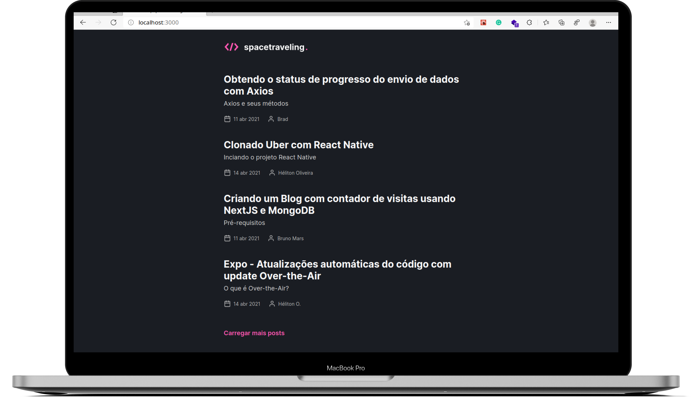
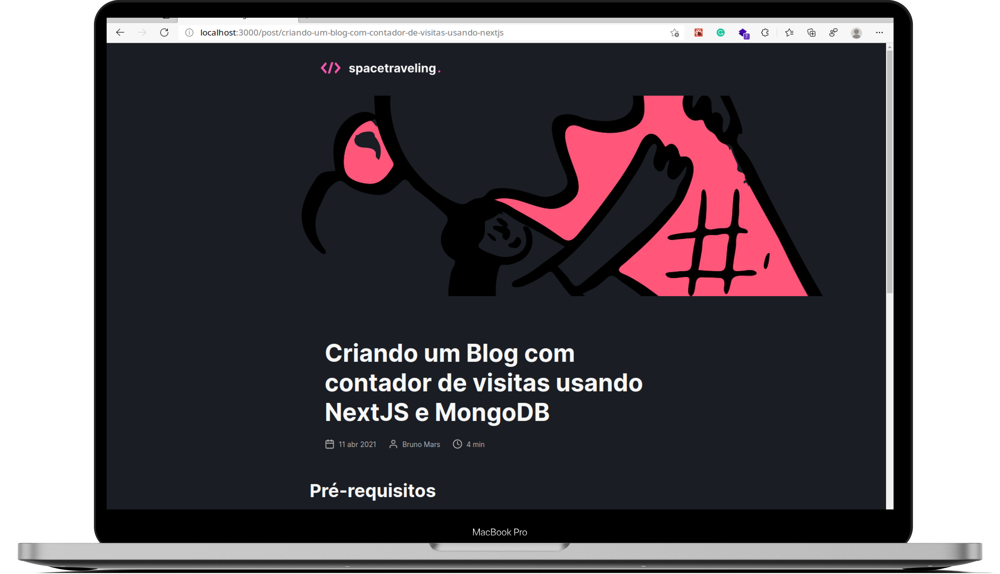

<h1 align="center">
  Ignite - Chapter III - Challenge01
</h1>

  

  

  

  

  

  

  
  

# :memo: About

In this challenge, my main objective was to consume a Prismic API and create a Blog application.
